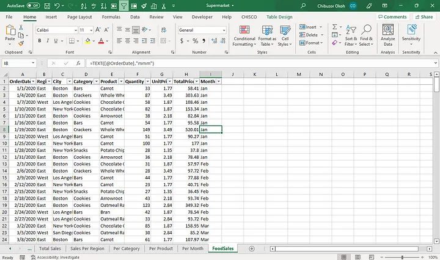
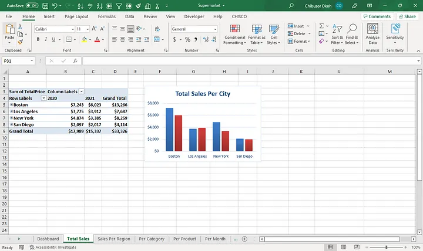
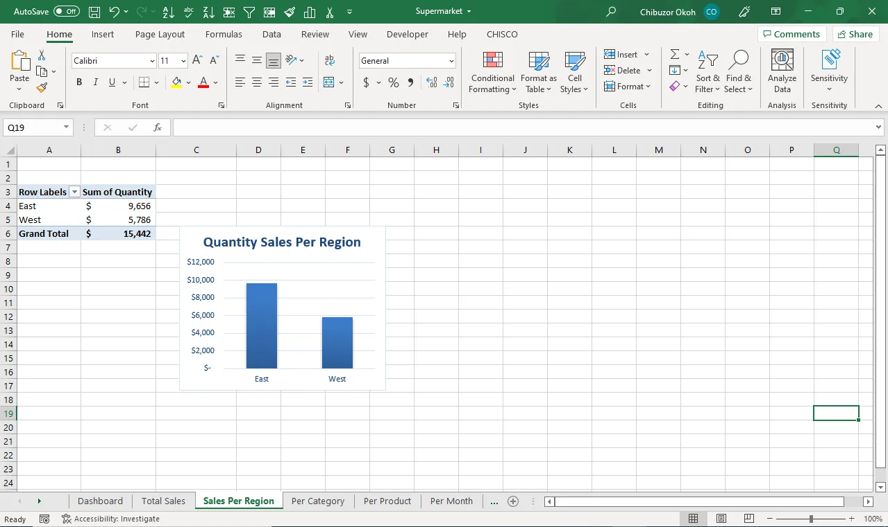
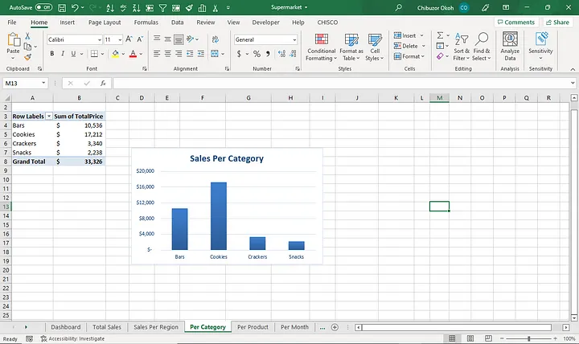
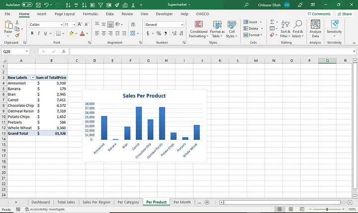
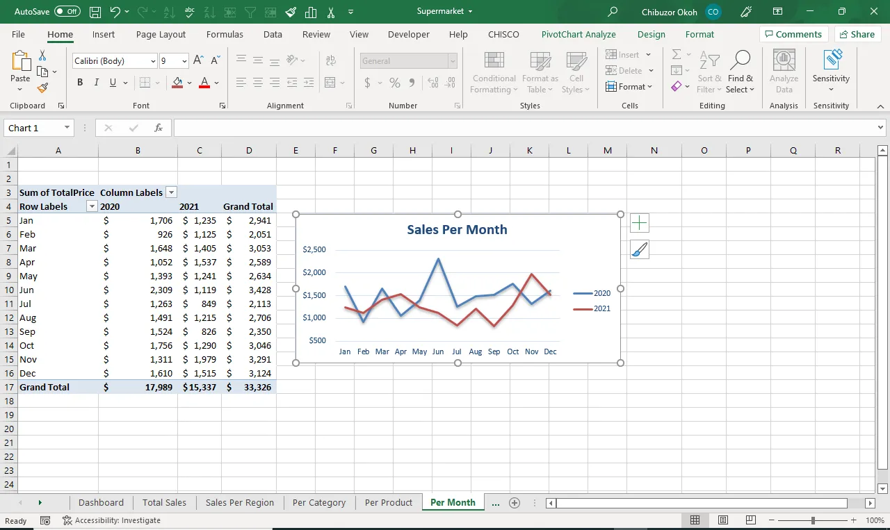
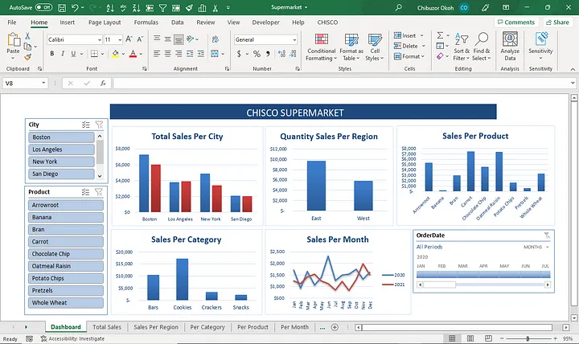

# Data-Analysis-with-Excel
DATA VISUALIZATION AND ANALYSIS USING THE SALES DATA OF A SUPERMARKET.

## Introduction

I worked on a Sales data gotten from Kaggle for a supermarket with branches in four cities (Boston, Los Angles, New York and San Diego) using Pivot Tables and Charts in Microsoft Excel. 

### Tools Used
---

- Microsoft Excel
- Pivot Tables
- Charts

### "Text" Function
---

Started by inserting a new column for Month, then I used the "TEXT" function to get the month in text format and this was useful during the visualization.

### Visualization
---

For the visualization, I created six (6) new sheets, inserted pivot table and renamed each of them.

### SHEET 1 (TOTAL SALES)
---
This sheet contains the chart which shows the total sales made per city in 2020 and 2021 with Boston having the highest sale of $7,243 and $6,023 respectively and San Diego having the lowest with $2,097 and $2,017.

### SHEET 2 (SALES PER REGION)
---
This sheet contains a chart showing the Quantity Sold Per Region (East and West) in 2020 and 2021. Sales was higher in the East with $9,656 compared to the West with $5,786.

### SHEET 3 (PER CATEGORY)
---
The chart here shows the total sales made by each category (Bars, Cookies, Crackers and Snacks) in 2020 and 2021. Cookies had the highest sales with $17,212 and Snacks had the lowest sales ($2,238).

### SHEET 4 (PER PRODUCT)
---
This chart shows all the products sold by the supermarket in 2020 and 2021. Carrots had the highest sales with $7,411 while Banana had the lowest sales ($179).

### SHEET 5 (PER MONTH)
---
This chart shows the sales made per month in 2020 and 2021. Sales in June 2020 was highest ($2,309) and the lowest was in September 2021 ($826).

With this visual, I was able to detect a massive sales drop in 2021 compared to that of 2020.

### SHEET 6 (DASHBOARD)
---
The charts in the sheets above were copied into this new sheet and arranged.

Slicers and Timeline were also added to the dashboard for easy navigation through the data.

### INSIGHTS
---
1. Highest sales are made at the middle and end of every year.

2. Carrots (the overall highest selling product) sold mostly in June 2020 ($749) at Boston, Los Angeles and New York.

3. Oatmeal Raisin (the 2nd overall highest selling product) also sold more in June 2020 ($963) at Boston.

4. Cookies sells more during the festive seasons, especially Arrowroot.

5. Pretzels and Banana are only sold in Boston.

6. Sales in San Diego are very low especially Crackers.

### RECOMMENDATIONS
---
1. Supply more of Oatmeal Raisin and Carrots to Boston, Los Angeles and New York.

2. Sale of Banana and Pretzels should be focused mainly in Boston.

3. More of Arrowroot should be supplied to the East and Chocolate Chips to the West.

### Connect with me
----
  [Linkedin](linkedin.com/in/chibuzor-data-analyst) 
  
[Twitter](https://twitter.com/cisco_official?t=zdocHllXoG5cV__V9h0pWg&s=09)

